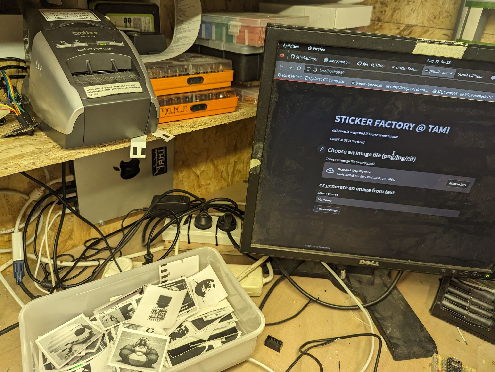

## printit
this was a fun experimante in the 2023 ccc camp, people printed a lot of stickers.

live at > https://print.tami.sh 

it currntly a mini obsession. it can do a few things and more to come.   
 * print images (dithered as its a b/w thing)
 * print labels, with QR codes if url provided
 * print masks for PCB DIY etching(!), use the transparent ones for best resualts (WIP)
 * print text2image using stable diffusion API
 * print cats

started as a fork of [brother_ql_web](https://github.com/pklaus/brother_ql_web) and his brother_ql [printer driver](https://github.com/matmair/brother_ql-inventree), this driver is maintained and developed by matmair 

network access by the openziti/zrok projects
### TBD
 * better text/label handeling
   * wrap text for printing paragraphs
   * rotate labels to print bigger stuff
 * ???
 * profit



### usage
added `streamlit`` to requirements.txt
```bash
pip install -r requirements.txt
streamlit run printit.py --server.port 8989
```

we use the [zrok.io](https://zrok.io/) to secure a static url. 
```
```bash
zrok reserve public 8989
zrok share reserved xxxxxx
```


### systemd
add you service to keep it alive. change `<user>` with your username. or any path to the printit folder.

create at `/etc/systemd/system/sticker_zrok.service`
```bash
[Unit]
Description=sticker factory
After=network.target

[Service]
ExecStart=/bin/bash -c 'source /home/<user>/printit/venv/bin/activate && streamlit run printit.py --server.port 8989'
WorkingDirectory=/home/<user>/printit
Environment="PATH=/home/devdesk/<user>/printit/venv/bin/python"
Restart=always
User=<user>
Group=<user>
[Install]
WantedBy=multi-user.target
```

```bash
sudo systemctl deamon-reload
sudo systemctl enable sticker.service
sudo systemctl start sticker.service

#debug using
sudo journalctl -u sticker.service --follow
sudo journalctl -u botprint.service --follow

```


we use the [zrok.io](https://docs.zrok.io/docs/guides/install/linux/) to secure a static url. 
```bash
zrok reserve public 8988
zrok share reserved kjvrml0bxatq
```
you can also run a service for this. 

